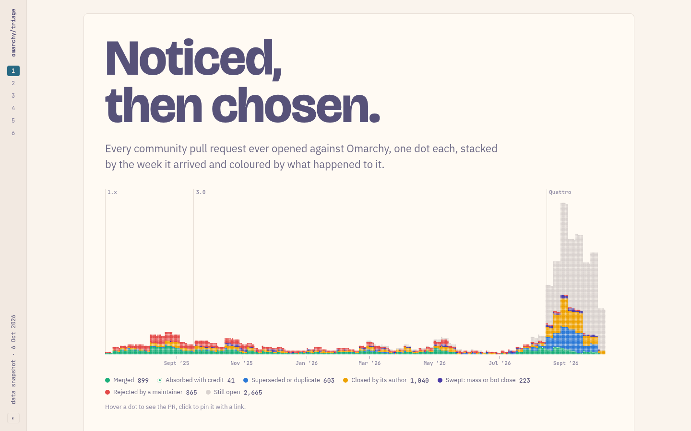

# Getting the Omarchy fame

**Read it here → [dt-lindberg.github.io/getting-the-omarchy-fame](https://dt-lindberg.github.io/getting-the-omarchy-fame/)**

[](https://dt-lindberg.github.io/getting-the-omarchy-fame/)

What happens to a community pull request on [Omarchy](https://github.com/omacom/omarchy), and what makes one get merged? This study follows all 6,336 community PRs from 26 June 2025 to 6 October 2026 through two steps: does a maintainer engage with it at all, and if so, is it accepted? The page shows where PRs drop out, what goes with getting noticed against getting chosen, and a playbook drawn from the numbers.

All findings are associations in observational data, not proof of cause.

## Data

Snapshot taken on 6 October 2026, in `data/snapshot/` (also attached to the [data release](https://github.com/dt-lindberg/getting-the-omarchy-fame/releases/tag/data-2026-10-06)):

| File | What it holds |
|---|---|
| `timelines.jsonl.gz` | Full GitHub timeline of every PR: comments, reviews, commits, labels, edits, closes |
| `prs_{open,merged,closed,user}.jsonl.gz` | Every PR with title, body, author, dates, size and files |
| `prs_v1_features.csv.gz` | Earlier feature table, used to detect PRs absorbed into maintainer commits |
| `community_for_topics.jsonl.gz` | Community PR titles and opening text, as given to the topic classifier |
| `commits.parquet` | `git log origin/quattro` with the area each commit touches |

Other committed outputs: `data/labels/topics.*` (kind and topic of each PR, labelled by Claude Haiku), `data/results/analysis.json` (all results), and `data/results/page.json` and `dots.json` (what the page draws).

## Reproduce

Requires [uv](https://docs.astral.sh/uv/).

```sh
uv sync
uv run python scripts/unpack_data.py       # snapshot -> data/raw/ and data/derived/
uv run python build_funnel.py --stage all  # per-PR funnel tables (about 90 s)
uv run python run_analysis.py              # models and summaries -> data/results/analysis.json
uv run python site/make_page_data.py       # -> data/results/page.json, dots.json
uv run python site/omarchy_themes.py       # installed Omarchy themes -> site/themes.json (committed)
uv run python site/build_page.py           # -> docs/index.html
uv run pytest                              # checks of the funnel rules
```

To refresh the data instead: `fetch_timelines.py` pulls timelines with the `gh` CLI, and `build_commits.py` reads a local clone of Omarchy (set `OMARCHY_REPO`, default `../omarchy`).

Working notes, including the brief and the classifier prompts, are in `notes/`.

## Licence

The code is under the [MIT licence](LICENSE). The snapshot holds public GitHub content (PR titles, descriptions, comments), which stays with its authors under [GitHub's terms](https://docs.github.com/en/site-policy/github-terms/github-terms-of-service).
